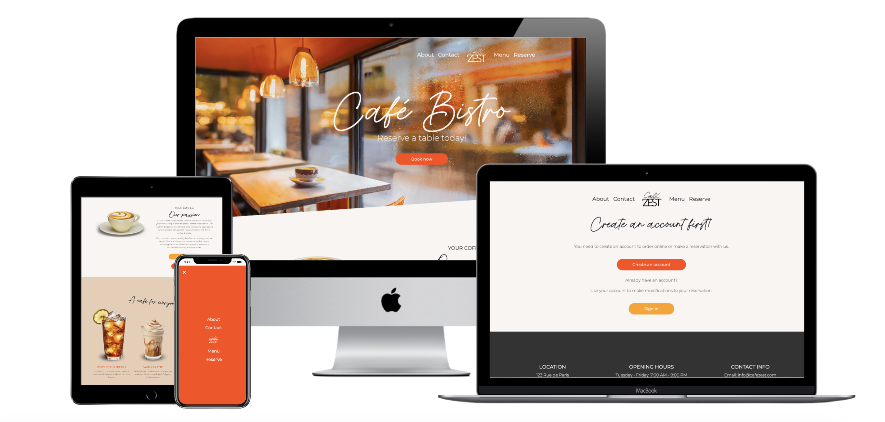

# CafeZest Website ☕



## Table of Contents

- [Introduction](#introduction)
- [Features](#features)
- [Getting Started](#getting-started)
- [Usage](#usage)
- [Roadmap](#roadmap)
- [Contributing](#contributing)
- [License](#license)

## Introduction

CafeZest is a website for a fictional coffeeshop. The website utilizes a technology stack including JavaScript, Python (Django), HTML, and CSS. The design theme revolves around bright orange, greens, and blues. To view the design details, please visit the project's
[Figma wireframe](https://www.figma.com/file/QXKgMa2qWfA1HNlFtdPfiz/Untitled?type=design&node-id=101%3A3&mode=design&t=Wr0bIlSj3lHTfaZa-1).

## Design

- **Full-Screen Hero Image**: Upon landing on the homepage, users are greeted with a captivating full-screen hero image. The image is accompanied by a tagline, header, paragraph, and two call-to-action buttons to engage visitors.

- **Design Integration**: The navigation bar is thoughtfully placed on the side to seamlessly integrate with the hero image, offering an unobtrusive and aesthetically pleasing design.

- **Responsive Design**: CafeZest is designed with a responsive layout, ensuring a seamless and enjoyable experience across various devices and screen sizes.

- **Menu Section**: Explore the diverse menu offerings. Each item is beautifully presented with images, descriptions, and pricing.

- **Footer**: The website includes a comprehensive footer with links to various sections, social media, and contact information.

## Features

- **User Authentication and Account Management**: Users can register, log in, and manage their accounts. The website ensures a personalized experience by displaying individual user reservations.

- **Booking System**: Reserve a spot for upcoming events or book a table for a relaxing coffee experience. Users can easily view, edit, and cancel their bookings.

- **Online Ordering Page**: Conveniently place orders online while browsing through the menu. The user can make a payment online through paypal or with their credit card.

- **Notification System**: Users receive timely notifications and alerts, enhancing their overall experience. Customized messages appear based on actions such as successful bookings or reservation cancellations.

## PayPal Integration

CafeZest leverages the PayPal payment gateway to facilitate secure online transactions. The integration with PayPal allows users to make payments for their online orders with confidence.

- **PayPal Business Account**: CafeZest utilizes a PayPal Business account to handle financial transactions securely.

- **PayPal Developer API**: The integration leverages PayPal Developer API to enable communication between the website and the PayPal platform.

- **Secure Credential Management**: All PayPal credentials are stored securely in an `env.py` file, which is included in the project's `.gitignore` to ensure sensitive information is not exposed. This best practice enhances security and protects user data.

## Getting Started

To get started with the CafeZest website, simply clone the repository and open the `index.html` file in your preferred web browser.

```bash
git clone https://github.com/your-username/cafezest.git
cd cafezest
```

## Usage
Explore the website's homepage and enjoy the visually pleasing design. Engage with the call-to-action buttons, check out the menu and order online, and manage your reservation easily.

- **Booking Page**: Reserve a spot for upcoming events or book a table for a relaxing coffee experience.

- **Online ordering Page**: Explore catering options for special occasions.

Stay tuned for these exciting additions!

## Contributing
Contributions are welcome! Feel free to fork the repository, make changes, and submit a pull request. For major changes, please open an issue first to discuss the proposed changes.

## License

This project is licensed under the [MIT License](LICENSE).
